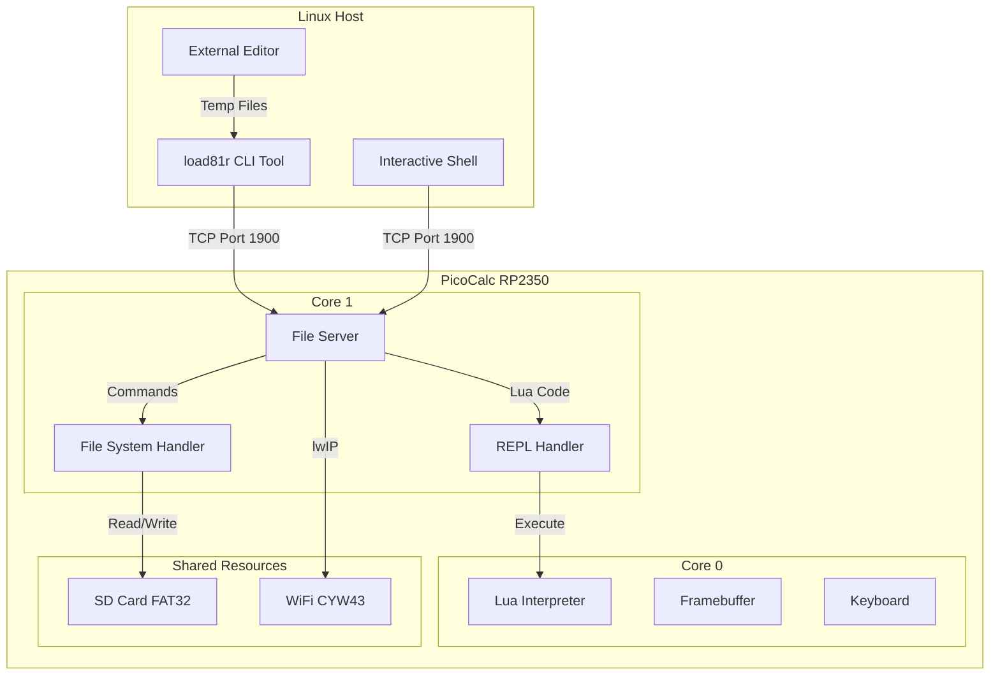

# LOAD81R Remote Shell Architecture

## Executive Summary

`load81r` is a Python3 remote shell tool for PicoCalc that provides file system access and Lua REPL functionality over TCP/IP. The system consists of:

1. **Server Component**: C implementation running on Core 1 of RP2350, replacing the existing diagnostic server on port 1900
2. **Client Component**: Python3 CLI tool providing interactive shell and command-line modes
3. **Protocol**: Simple text-based command/response protocol for reliability and debuggability

## System Architecture



## Protocol Specification

### Design Principles

1. **Text-Based**: Human-readable for debugging with netcat/telnet
2. **Line-Oriented**: Commands and responses terminated by `\n`
3. **Simple Framing**: Length-prefixed binary data for file transfers
4. **Stateful**: Server maintains current directory per connection
5. **Single-Client**: Only one active connection at a time

### Command Format

```
COMMAND [ARG1] [ARG2] ...\n
```

### Response Format

```
+OK [DATA]\n          # Success with optional data
-ERR [MESSAGE]\n      # Error with message
+DATA [LENGTH]\n      # Binary data follows
[BINARY DATA]
+END\n               # End of binary data
```

### Protocol Commands

| Command | Arguments | Description | Response |
|---------|-----------|-------------|----------|
| `HELLO` | `version` | Protocol handshake | `+OK load81r/1.0` |
| `PWD` | - | Get current directory | `+OK /path` |
| `CD` | `path` | Change directory | `+OK` or `-ERR` |
| `LS` | `[path]` | List directory | `+DATA` with JSON array |
| `CAT` | `path` | Read file | `+DATA` with file content |
| `PUT` | `path length` | Write file | `+READY` then send data |
| `MKDIR` | `path` | Create directory | `+OK` or `-ERR` |
| `RM` | `path` | Delete file/dir | `+OK` or `-ERR` |
| `STAT` | `path` | Get file info | `+OK` with JSON |
| `REPL` | `code` | Execute Lua | `+OK` with output |
| `PING` | - | Keep-alive | `+OK` |
| `QUIT` | - | Close connection | `+OK` |

### Example Session

```
Client: HELLO load81r/1.0\n
Server: +OK load81r/1.0\n

Client: PWD\n
Server: +OK /\n

Client: LS /load81\n
Server: +DATA 156\n
Server: [{"name":"nex.lua","size":4523,"is_dir":false},{"name":"examples","size":0,"is_dir":true}]\n
Server: +END\n

Client: CAT /load81/nex.lua\n
Server: +DATA 4523\n
Server: [4523 bytes of file content]
Server: +END\n

Client: REPL print(2+2)\n
Server: +OK 4\n

Client: QUIT\n
Server: +OK\n
```

## Server Architecture (C Implementation)

### File Structure

```
src/
├── picocalc_file_server.c      # Main server implementation
├── picocalc_file_server.h      # Public API
├── picocalc_fs_handler.c       # File system operations
├── picocalc_fs_handler.h       # FS handler API
├── picocalc_repl_handler.c     # REPL integration
└── picocalc_repl_handler.h     # REPL handler API
```

### Core Components

#### 1. File Server (`picocalc_file_server.c`)

**Responsibilities:**
- TCP server on port 1900
- Connection management (single client)
- Protocol parsing and command dispatch
- Response formatting
- Session state (current directory)

**Key Functions:**
```c
bool file_server_init(void);
bool file_server_start(void);
void file_server_stop(void);
bool file_server_is_running(void);
```

**State Machine:**
```
IDLE -> LISTENING -> CONNECTED -> PROCESSING -> CONNECTED
                         |                          |
                         +--------QUIT--------------+
                         |                          |
                         +-------ERROR--------------+
```

#### 2. File System Handler (`picocalc_fs_handler.c`)

**Responsibilities:**
- FAT32 operations via existing driver
- Path normalization and validation
- Directory traversal
- File I/O with streaming
- JSON formatting for directory listings

**Key Functions:**
```c
fs_error_t fs_list_dir(const char *path, char **json_out);
fs_error_t fs_read_file(const char *path, uint8_t **data, size_t *size);
fs_error_t fs_write_file(const char *path, const uint8_t *data, size_t size);
fs_error_t fs_delete(const char *path);
fs_error_t fs_mkdir(const char *path);
fs_error_t fs_stat(const char *path, fs_stat_t *stat);
```

#### 3. REPL Handler (`picocalc_repl_handler.c`)

**Responsibilities:**
- Execute Lua code on Core 0
- Capture output (stdout/stderr)
- Handle errors gracefully
- Timeout protection

**Key Functions:**
```c
repl_error_t repl_execute(const char *code, char **output);
```

**Implementation Strategy:**
- Use inter-core FIFO for communication
- Core 1 sends Lua code to Core 0
- Core 0 executes and sends back result
- Timeout after 5 seconds

### Memory Management

**Buffer Sizes:**
- Command buffer: 1KB (max command line)
- Response buffer: 4KB (for small responses)
- File transfer buffer: 8KB (streaming chunks)
- Directory listing buffer: 16KB (JSON array)

**Allocation Strategy:**
- Static buffers for protocol handling
- Dynamic allocation for file content (with limits)
- Maximum file size: 1MB (configurable)

### Thread Safety

**SD Card Access:**
- Core 1 has exclusive access during file operations
- Core 0 Lua filesystem functions disabled when server active
- Mutex protection for FAT32 driver (if needed)

**Shared State:**
- WiFi stack (lwIP) is thread-safe
- No shared memory between cores except FIFO

## Client Architecture (Python3 Implementation)

### File Structure

```
tools/
└── load81r/
    ├── load81r.py              # Main entry point
    ├── client.py               # TCP client and protocol
    ├── shell.py                # Interactive shell
    ├── commands.py             # Command implementations
    ├── sync.py                 # Rsync functionality
    └── editor.py               # External editor integration
```

### Core Components

#### 1. Main Entry Point (`load81r.py`)

**Responsibilities:**
- Argument parsing
- Mode selection (interactive vs command-line)
- Connection establishment
- Error handling

**Usage:**
```bash
# Interactive mode
load81r 192.168.1.100

# Command-line mode
load81r 192.168.1.100 ls /load81
load81r 192.168.1.100 cat /load81/nex.lua
load81r 192.168.1.100 rsync /load81 ./backup
```

#### 2. Protocol Client (`client.py`)

**Responsibilities:**
- TCP connection management
- Protocol encoding/decoding
- Binary data transfer
- Error handling and retries

**Key Classes:**
```python
class Load81Client:
    def connect(self, host: str, port: int = 1900) -> bool
    def send_command(self, cmd: str, *args) -> Response
    def receive_response(self) -> Response
    def receive_data(self) -> bytes
    def send_data(self, data: bytes) -> bool
    def close(self)
```

#### 3. Interactive Shell (`shell.py`)

**Responsibilities:**
- Command-line interface with prompt
- Command history (readline)
- Tab completion
- Help system
- Local/remote path handling

**Features:**
- Prompt shows current remote directory: `picocalc:/load81> `
- Command history saved to `~/.load81r_history`
- Tab completion for remote paths
- Local commands prefixed with `!` (e.g., `!ls`)

#### 4. Command Implementations (`commands.py`)

**Command Handlers:**

```python
def cmd_cat(client: Load81Client, *files) -> int
def cmd_cd(client: Load81Client, path: str) -> int
def cmd_cp(client: Load81Client, src: str, dst: str) -> int
def cmd_edit(client: Load81Client, file: str) -> int
def cmd_help(client: Load81Client) -> int
def cmd_ls(client: Load81Client, path: str = None) -> int
def cmd_mkdir(client: Load81Client, path: str) -> int
def cmd_repl(client: Load81Client) -> int
def cmd_rm(client: Load81Client, *paths) -> int
def cmd_rsync(client: Load81Client, src: str, dst: str) -> int
```

#### 5. Rsync Implementation (`sync.py`)

**Responsibilities:**
- Recursive directory synchronization
- File comparison (size, timestamp)
- Progress reporting
- Conflict resolution

**Algorithm:**
1. List remote directory recursively
2. Compare with local directory
3. Identify new/modified/deleted files
4. Transfer only changed files
5. Update local timestamps

#### 6. Editor Integration (`editor.py`)

**Responsibilities:**
- Download file to temp location
- Launch external editor ($EDITOR or nano)
- Detect changes
- Upload modified file

**Workflow:**
1. `CAT` file from PicoCalc
2. Write to `/tmp/load81r_XXXXX`
3. Launch editor and wait
4. Check if file modified
5. `PUT` file back if changed

## Command Specifications

### 1. cat - Display File Contents

**Usage:** `cat FILE [FILE...]`

**Implementation:**
- Send `CAT path` for each file
- Receive `+DATA length` response
- Read binary data
- Print to stdout
- Support multiple files

**Error Handling:**
- File not found: Print error, continue with next file
- Permission denied: Print error, exit code 1
- Connection lost: Exit with error

### 2. cd - Change Directory

**Usage:** `cd DIRECTORY`

**Implementation:**
- Send `CD path`
- Receive `+OK` or `-ERR`
- Update shell prompt on success

**Special Cases:**
- `cd` with no args: Go to root `/`
- `cd ..`: Go to parent directory
- `cd -`: Go to previous directory (shell tracks)

### 3. cp - Copy Files

**Usage:** `cp SOURCE DEST`

**Implementation:**
- Determine if source is remote or local
- Determine if dest is remote or local
- Support patterns:
  - `cp remote:/path local/path` (download)
  - `cp local/path remote:/path` (upload)
  - `cp remote:/src remote:/dst` (server-side copy)

**Algorithm (Download):**
1. `STAT source` to get size
2. `CAT source` to get data
3. Write to local file
4. Set timestamp if available

**Algorithm (Upload):**
1. Read local file
2. `PUT dest size`
3. Wait for `+READY`
4. Send binary data
5. Wait for `+OK`

### 4. edit - Edit File

**Usage:** `edit FILENAME`

**Implementation:**
1. Check if file exists with `STAT`
2. Download with `CAT` to temp file
3. Launch `$EDITOR` (default: nano)
4. Wait for editor to close
5. Check if file modified (mtime/hash)
6. Upload with `PUT` if changed
7. Clean up temp file

**Editor Selection:**
1. `$EDITOR` environment variable
2. `nano` if available
3. `vi` as fallback
4. Error if no editor found

### 5. help - Show Help

**Usage:** `help [COMMAND]`

**Implementation:**
- No server interaction
- Display built-in help text
- If command specified, show detailed help
- List all commands if no arg

### 6. ls - List Directory

**Usage:** `ls [PATH]`

**Implementation:**
- Send `LS path` (or current dir if no path)
- Receive `+DATA` with JSON array
- Parse JSON
- Format output (similar to `ls -lh`)
- Color coding: directories (blue), files (white)

**Output Format:**
```
drwxr-xr-x  examples/
-rw-r--r--  4.5K  nex.lua
-rw-r--r--  1.2K  test.txt
```

### 7. mkdir - Create Directory

**Usage:** `mkdir DIRECTORY`

**Implementation:**
- Send `MKDIR path`
- Receive `+OK` or `-ERR`
- Support `-p` flag for recursive creation (client-side)

**Recursive Creation:**
1. Split path into components
2. Create each level if it doesn't exist
3. Ignore "already exists" errors

### 8. repl - Lua REPL

**Usage:** `repl`

**Implementation:**
- Enter interactive Lua REPL mode
- Prompt: `lua> `
- Send each line as `REPL code`
- Display output
- Exit with Ctrl+D or `exit()`

**Features:**
- Command history
- Multi-line input (detect incomplete statements)
- Syntax highlighting (optional, using Pygments)
- Tab completion for Lua keywords

**Special Commands:**
- `.exit` - Exit REPL
- `.help` - Show REPL help
- `.clear` - Clear screen

### 9. rm - Remove Files/Directories

**Usage:** `rm PATH [PATH...]`

**Implementation:**
- Send `RM path` for each path
- Receive `+OK` or `-ERR`
- Support `-r` flag for recursive deletion
- Prompt for confirmation on directories

**Safety:**
- Require `-r` for directories
- Prompt: "Remove directory 'path'? (y/n)"
- Skip on 'n', continue on 'y'

### 10. rsync - Synchronize Directories

**Usage:** `rsync SOURCE DEST`

**Implementation:**
- Support patterns:
  - `rsync /remote/path ./local` (download)
  - `rsync ./local /remote/path` (upload)
- Recursive by default
- Compare files by size and timestamp
- Show progress bar

**Algorithm (Download):**
1. `LS -R source` to get full tree
2. Compare with local tree
3. Create missing directories
4. Download new/modified files
5. Optionally delete extra local files

**Progress Display:**
```
Syncing /load81 -> ./backup
[=====>    ] 50% (5/10 files) nex.lua
```

## Error